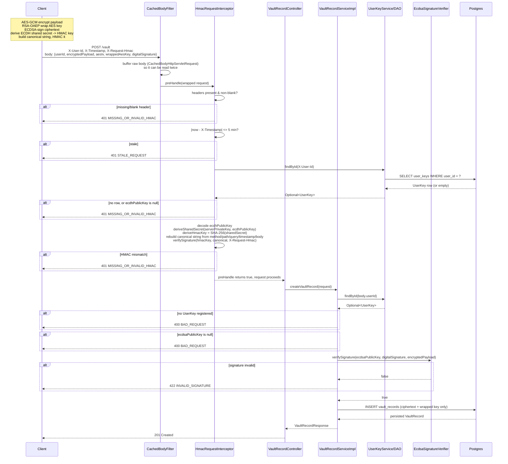

# Secure Vault Service

A "Zero-Knowledge Secure Vault" learning project — a Spring Boot backend that stores client-encrypted secrets and progressively layers on cryptographic guarantees across four phases: data-at-rest encryption, sender identity, transit integrity, and (planned) hardware-backed authentication.

The server never sees plaintext and never holds a private key belonging to a client. All cryptography that protects the *payload* happens client-side before a request is ever sent; the server's job is to store ciphertext, verify proofs (signatures, HMACs) that clients attach, and reject anything that doesn't check out.

## Roadmap

| Phase | Name | Status | What it proves |
|---|---|---|---|
| 1 | Data at Rest | Done | Payloads are AES-256-GCM encrypted client-side; the AES key is RSA-OAEP wrapped so only the intended recipient's private key can unwrap it. Server stores ciphertext only. |
| 2 | Identity | Done | Every upload carries an ECDSA (P-256) signature over the encrypted payload, verified server-side against a registered public key — proves the caller holds a specific private key. |
| 3 | Transit | In progress | An ECDH (P-256) handshake between client and server derives a shared secret that keys an HMAC over the *entire* canonical request (method, path, query, timestamp, body) — proves the request in flight wasn't tampered with or replayed, on reads and deletes too, not just uploads. |
| 4 | Hardware Auth | Planned | WebAuthn/FIDO2 attestation replaces the plain client-supplied `userId` with real authentication. |

Each phase's full design spec lives under `docs/superpowers/specs/`.

## High-Level Design

### Layered architecture

Standard layered Spring Boot MVC, unchanged in shape across all three shipped phases:

```
Controller  →  Service  →  Repository (DAO)  →  Postgres
    ↑                           ↑
    |                    CustomThreadPool
    |                (DB / computation / HTTP executors —
    |                 every DAO call runs off-request-thread,
    |                 composed via CompletionStage)
    |
HmacRequestInterceptor (Phase 3, /api/v1/vault/** only)
    ↑
CachedBodyFilter (buffers POST bodies so both the
 interceptor and the controller's @RequestBody can
 each read them once, independently)
```

Entities are never returned directly — every controller returns a `response/*.java` record built via a static `from(entity)` factory. Cross-cutting crypto logic (`EcdsaSignatureVerifier`, `EcdhSharedSecretResolver`, `HmacRequestVerifier`) is isolated in a dedicated `crypto` package, each class exposing one verifiable, independently-unit-testable method — never inlined into service logic.

### Request flow (current: Phases 1–3)

```
Client                                   Server
------                                   ------
1. Generate AES-256 key; encrypt
   payload -> AES-GCM ciphertext + IV
2. Wrap AES key with recipient's
   RSA public key (RSA-OAEP)
3. Sign ciphertext with own ECDSA
   private key (SHA256withECDSA)
4. Derive ECDH shared secret from
   own private key + server's
   static public key -> SHA-256 ->
   HMAC key
5. Build canonical request string:
   METHOD\nPATH\nQUERY\nTIMESTAMP\nBODY
   HMAC-SHA256 it -> X-Request-Hmac
                                          6. CachedBodyFilter buffers the body
                                             (POST only)
                                          7. HmacRequestInterceptor.preHandle:
                                             - headers present & fresh (<5 min)?
                                             - UserKey + ecdhPublicKey registered?
                                             - rebuild canonical string, derive
                                               same HMAC key, compare
                                             -> 401 on any failure, else proceed
                                          8. Controller: (POST only) look up
                                             UserKey.ecdsaPublicKey, verify
                                             ECDSA signature over ciphertext
                                             -> 422 on failure
                                          9. Persist / fetch / delete
                                             VaultRecord (ciphertext + wrapped
                                             key only — server never decrypts)
```

Reads (`GET`) and deletes (`DELETE`) only pass through the Phase 3 HMAC check (steps 6–7) — Phase 2's ECDSA check (step 8) only ever applied to `POST /api/v1/vault`.

### Sequence diagram — `POST /api/v1/vault`

The write path exercises every phase's check in one request, so it's the most complete illustration of the pipeline. `GET`/`DELETE` follow the same shape minus the `CachedBodyFilter` (no body) and the ECDSA step (controller persists/fetches/deletes directly after the interceptor passes).



### Data model

**`UserKey`** (`user_keys`, `@Id userId` — client-supplied, no `@GeneratedValue`) — one row per client identity, three independently-nullable public keys registered via the same upsert endpoint:
- `rsaPublicKey` — Phase 1, used to wrap the AES key for that user.
- `ecdsaPublicKey` — Phase 2, used to verify upload signatures.
- `ecdhPublicKey` — Phase 3, used to derive the per-request HMAC key.

**`VaultRecord`** (`vault_records`, `@Id vaultRecordId`, server-generated UUID) — `userId`, `encryptedPayload`, `aesIv`, `wrappedAesKey`, `digitalSignature`. The server persists ciphertext and wrapped-key material only; it has no way to recover plaintext.

Both entities extend `BaseEntity` (`createdAt`/`updatedAt`/`version` optimistic-locking/audit columns, plus a free-form `attrs` JSONB column).

### Crypto components (`crypto` package)

| Class | Responsibility |
|---|---|
| `EcdsaSignatureVerifier` | `verifySignature(base64PublicKey, base64Signature, signedContent)` — P-256 / SHA256withECDSA verification. Catches malformed-base64/key exceptions internally and returns `false` rather than propagating. |
| `ServerEcdhKeyHolder` | Generates one static P-256 ECDH keypair at startup, held in memory for the process lifetime (never persisted, never rotated — acceptable for a learning-project demo). |
| `EcdhSharedSecretResolver` | `deriveSharedSecret(privateKey, publicKey)` via `KeyAgreement.getInstance("ECDH")`; `deriveHmacKey(sharedSecret)` = `SHA-256(sharedSecret)`; `decodePublicKey(base64Spki)` to parse a stored/received key. |
| `HmacRequestVerifier` | `verifySignature(hmacKey, canonicalRequest, base64Hmac)` — `HmacSHA256`, constant-time compare via `MessageDigest.isEqual`. |

### Error handling

A single `@ControllerAdvice` (`SecureVaultExceptionHandler`) maps every `SecureVaultException` to a JSON body (`errorCode`, `errorMessage`, `errorType`, `additionalInfo`) and the matching `HttpStatus`, driven entirely by the thrown `SecureVaultErrorType` enum constant — interceptor-thrown exceptions (Phase 3's HMAC/staleness checks) go through the exact same path as controller/service-thrown ones, so error formatting is consistent everywhere in the service.

| Code | Meaning |
|---|---|
| `ERR_SV_003` `NOT_FOUND` | Vault record or user key not found |
| `ERR_SV_005` `BAD_REQUEST` | Missing/incomplete `UserKey` registration, validation failure |
| `ERR_SV_009` `INVALID_SIGNATURE` | ECDSA verification failed on `POST /vault` |
| `ERR_SV_010` `MISSING_OR_INVALID_HMAC` | Missing HMAC headers, unregistered `ecdhPublicKey`, or HMAC mismatch |
| `ERR_SV_011` `STALE_REQUEST` | `X-Timestamp` outside the 5-minute freshness window |

### API surface

```
POST   /api/v1/users/{userId}/keys        upsert rsaPublicKey / ecdsaPublicKey / ecdhPublicKey
GET    /api/v1/keys/server/ecdh-public-key   the server's static ECDH public key (no auth; outside /vault/** scope)

POST   /api/v1/vault                      create — requires HMAC headers + ECDSA digitalSignature
GET    /api/v1/vault/{vaultRecordId}      fetch one — requires HMAC headers
GET    /api/v1/vault?userId=&page=&size=  list — requires HMAC headers
DELETE /api/v1/vault/{vaultRecordId}      delete — requires HMAC headers
```

All routes are served under the context path configured in `application.properties` (`server.servlet.context-path`), e.g. `http://localhost:8080/secure-vault/api/v1/vault`.

Every `/api/v1/vault/**` request must carry:
```
X-User-Id: <userId>
X-Timestamp: <epoch millis>
X-Request-Hmac: <base64 HMAC-SHA256 over METHOD\nPATH\nQUERY_STRING\nTIMESTAMP\nBODY>
```

### Non-goals (explicitly deferred)

- No TLS/confidentiality-in-transit story — this is an integrity/freshness/identity layer over plain HTTP; a real deployment would put TLS underneath it.
- No nonce-based replay protection — a 5-minute timestamp window is the only anti-replay defense; a captured request is replayable within that window.
- No key rotation, versioning, or session expiry.
- No real authentication — `userId` is still a plain client-supplied header/field until Phase 4's WebAuthn/FIDO2 work lands.

## Running locally

Requires Java 21+, Maven, and a local Postgres instance matching `application.properties` (`jdbc:postgresql://localhost:5432/postgres`).

```
mvn spring-boot:run
```

Schema is managed via `spring.jpa.hibernate.ddl-auto=update` — no manual migrations needed.

## Demo tooling

`scripts/generate_vault_payload.py` is a standalone Python script (not part of the Maven build) that generates real RSA/ECDSA/ECDH key material, encrypts and signs a sample payload, fetches the server's ECDH public key, computes correctly-signed HMAC headers, and prints ready-to-paste `curl`/Postman requests for every endpoint above. It is a manual demo tool, not an automated test client — see the script's own docstring for usage and its per-`--user-id` key-caching behavior.

```
pip install cryptography requests
python3 scripts/generate_vault_payload.py --user-id demo-user-1
```
